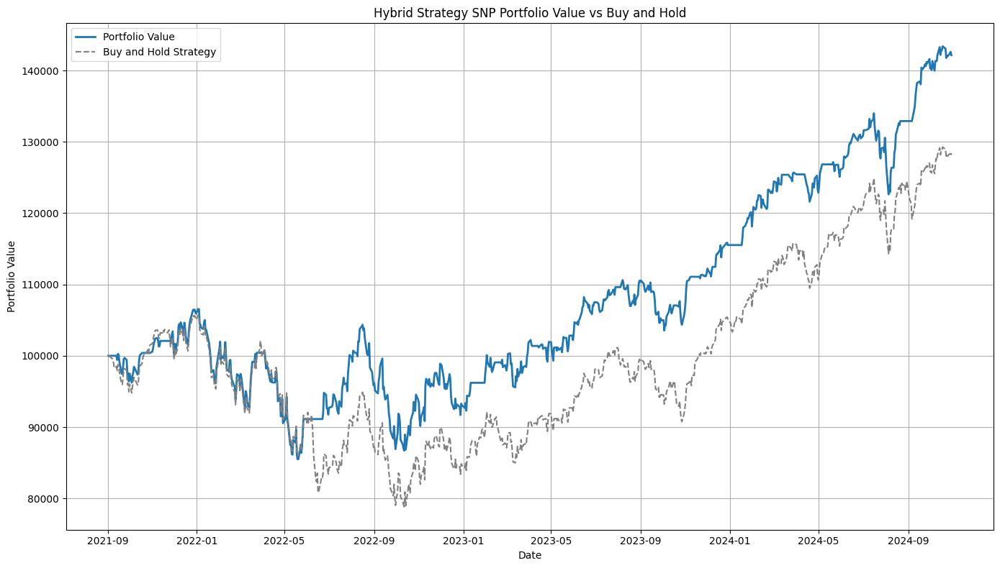

# ML-Based Trading Strategies

## Objective
This ML-based trading strategy leverages machine learning models to predict asset price movements and generate optimized trade signals. It combines **technical indicators, ML classification models, and adaptive signal optimization** to enhance returns while reducing risk.

## Methodology
### **Feature Engineering & Indicators**
- **Technical Indicators created**:
  - Simple & Exponential Moving Averages (SMA, EMA).
  - MACD & Signal Line for momentum analysis.
  - Bollinger Bands for volatility detection.
  - ATR for stop-loss calculations.
  - RSI for overbought/oversold signals.
  - ADX for trend signals.
- **Machine Learning Models**:
  - **Random Forest & Gradient Boosting Machines (GBM)** for price movement prediction.
  - **Ensemble Voting Classifier** for signal confirmation.
- **Signal Generation & Trade Execution**: \
multi signal buy /sell based on buy / sell thresholds (Basically, it buys if there are multiple buys and sells if there are numerous sells). The final sell/buy signal is optimized via thresholds.
  - **Entry Conditions**:
    - ML model's indicator taken only if above a high confidence threshold (in this case `0.75` ).
    - RSI, MACD, and Bollinger Bands, ADX confirm the trend.
  - **Exit Conditions**:
    - ML model detects trend reversal or decreasing probability.
    - RSI, MACD, and Bollinger Bands, ADX confirm the trend.
    - Stop-loss triggered using ATR-based multiplier.
- **Custom Backtesting**:
  - Implemented custom backtesting logic to evaluate strategy performance.
  - **Risk-adjusted return optimization** for improved robustness.
- **Walk-Forward Optimization**
- **Parameter tuning** using cross-validation to dynamically adjust buy/sell thresholds.
- **Risk-adjusted return optimization** for improved robustness.
  
---

## **Results & Performance**

### **S&P500 Strategy Results**

Implemented backtesting with `Walk-forward` optimization to ensure no look ahead biases were there. Results :  
- **Cumulative Return**: ~76% over the test period.
- **Maximum Drawdown**: ~19%.
- **Number of Trades**: 963.
- **Sharpe Ratio**: ~1.04.

#### **Trade Signals (S&P500)**
 

#### **Cumulative Return vs Benchmark**
 

#### **Monte Carlo Simulation (USATECH)**

#### **Sensitivity Analysis (S&P500)**
  

---

### **US Technology Sector Strategy Results**

Implemented backtesting with `Walk-forward` optimization to ensure no look ahead biases were there. Results :  
- **Cumulative Return**: ~84% over the test period.
- **Maximum Drawdown**: ~27%.
- **Number of Trades**: 906.
- **Sharpe Ratio**: ~0.71.

#### **Trade Signals (USATECH)**
  

#### **Cumulative Return vs Benchmark (USATECH)**
  

#### **Monte Carlo Simulation (USATECH)**
  

#### **Sensitivity Analysis (S&P500)**
  

---

## Discussion
- **Strengths**:
  - Captures **trend-based** market movements effectively.
  - Walk-forward optimization improves robustness over static thresholds.
- **Limitations**:
  - Requires periodic retraining for optimal performance.
  - Dependent on **hyperparameter tuning**.

## Future Enhancements
- **Deep Learning Integration**: Implement LSTMs, CNNs for sequence modeling.
- **Alternative Data Sources**: Incorporate macroeconomic indicators, news sentiment.
- **Reinforcement Learning**: Optimize trade execution dynamically.

## Contributing
If you have improvements or new strategies, feel free to open a PR!