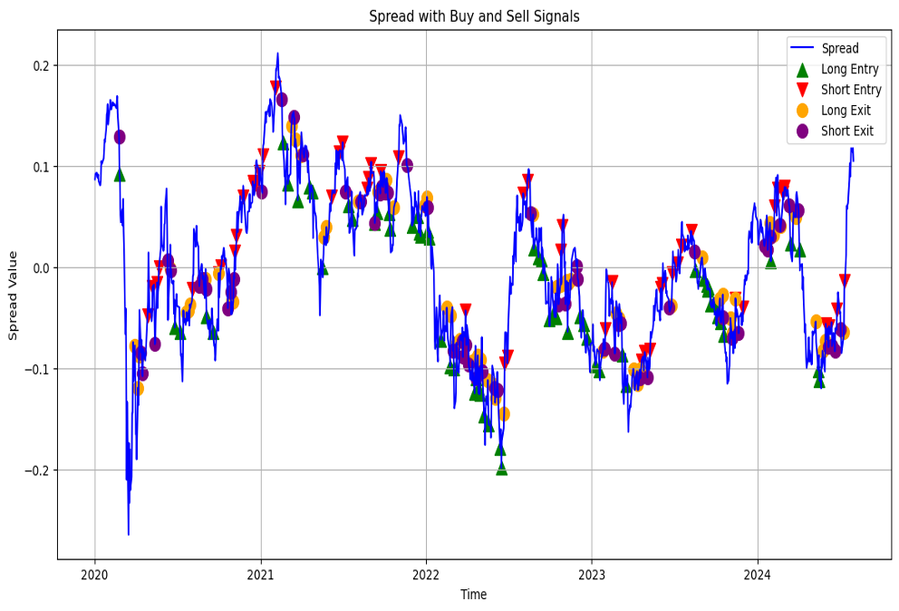
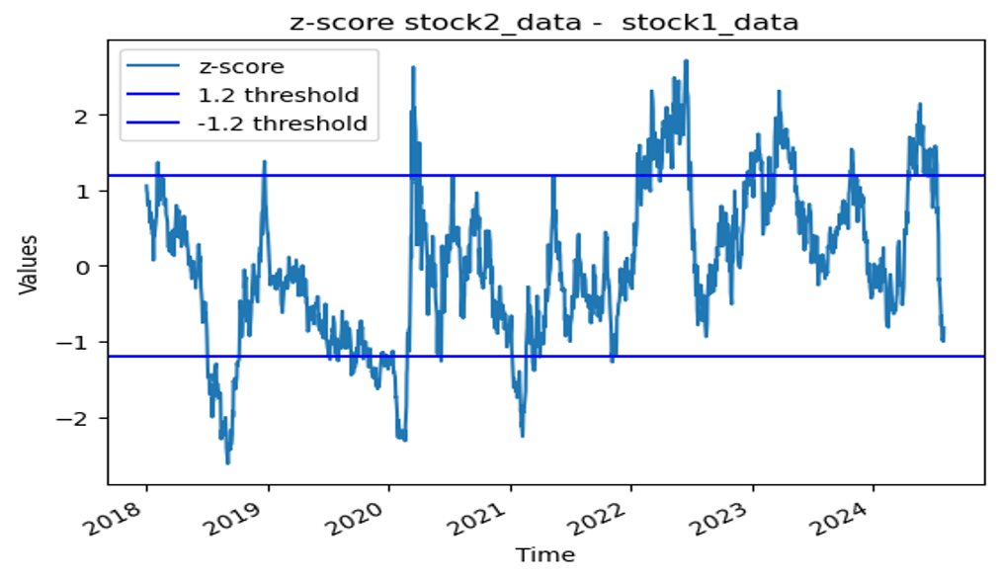
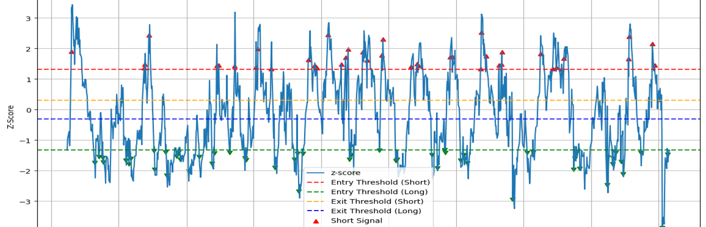
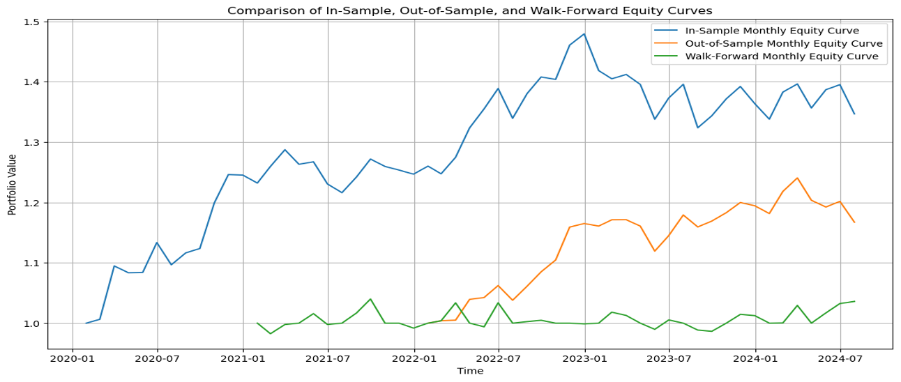
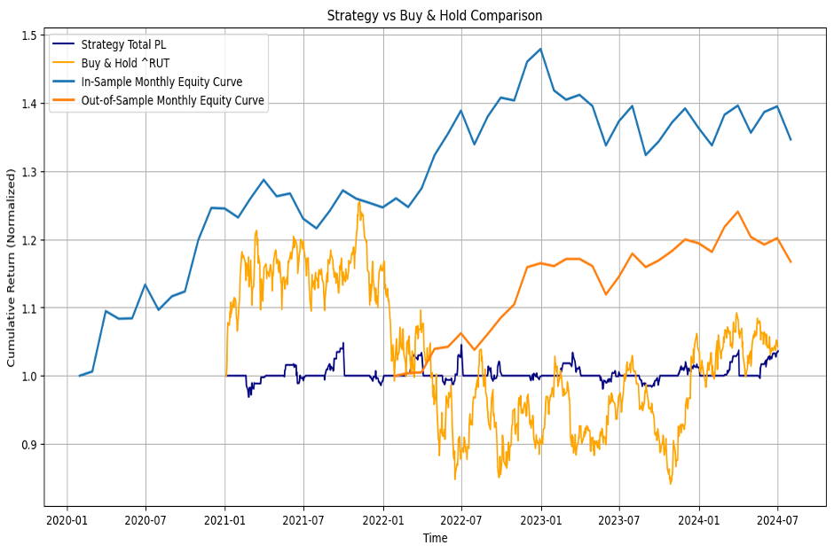
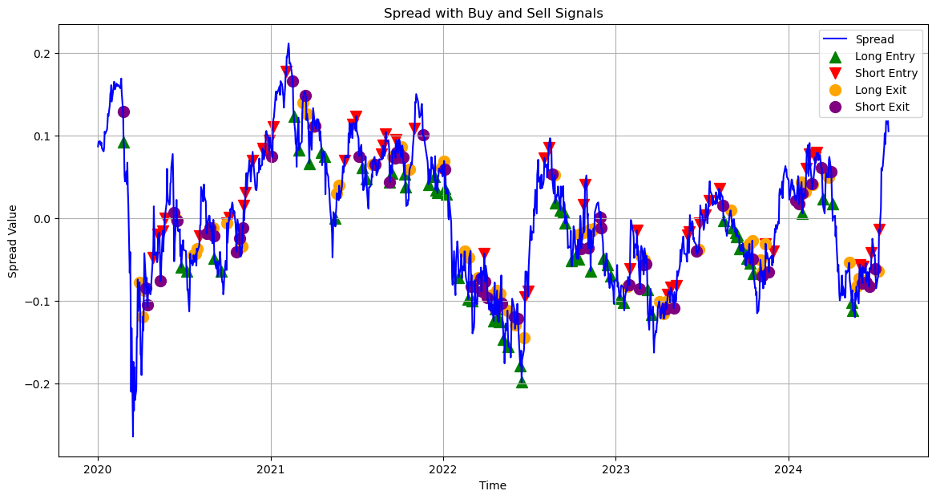

# PAIR-WISE-ALGORITHMIC-TRADING WITH COINTEGRATION ANALYSIS

# Objective of the Analysis

To implement a Pairs Trading Strategy using statistical and technical indicators.
Analyze the relationship between ^RUT (Russell 2000) and HG=F (Copper Futures).
Develop entry and exit signals based on Z-score and technical indicators.
Evaluate strategy performance using equity curves and metrics like Sharpe Ratio

# Data Collection

Source: 
USSC2000.IDXUSD & COPPER.CMDUSD FROM YAHOO FINANCE

Time Period: 
January 2020 - August 2024

Data Frequency:
Daily

Assets Used:
RUT: Russell 2000 Index
HG=F: Copper Futures

# Statistical Analysis

Log Transformation: 
Log-transformed prices for linearity.

OLS Regression:
Dependent Variable (Y): Copper Futures (^HG=F)
Independent Variable (X): Russell 2000 (^RUT)

Spread Calculation:
Spread = Y - (alpha + beta * X)
Rolling Z-score to normalize the spread

# Technical Indicators Used

RSI:
Measures Momentum 
Overbought > 70
Oversold < 30

MACD:
Momentum indicator using short-term and long-term EMAs Includes Signal Line Crossovers

Bollinger Bands:
Measures Volatility Bands calculated using 20-day SMA +- 2

# Signal Generation Logic

Entry Signals:
Long: Z-score < -1.9, RSI < -10, MACD Difference > 0.
Short: Z-score > 1.9, RSI > 10, MACD Difference < 0.

Exit Signals:
Long Exit: Z-score > -0.3 or RSI > 0.
Short Exit: Z-score < 0.3 or RSI < 0.

# Backtesting Setup

In-Sample vs. Out-of-Sample:
Trained model (alpha, beta) on a historical segment (in-sample).
Evaluated strategy on subsequent, unseen data (out-of-sample).
Walk-Forward Testing:
Periodically refitted model on a rolling window.
Tested on the following period to simulate a real-time environment.
Transaction Costs & Slippage:
Incorporated fixed costs per trade to approximate real-world conditions.
Performance Metrics:
Cumulative Return, Sharpe Ratio, Max Drawdown.
Compared with Buy & Hold benchmark.
Result Highlights:
Moderate returns, contained drawdowns.
Limited outperformance vs. benchmark in tested timeframe.

# Visual representation of portfolio value over time. Includes all portfolio performance

# Performance Metrics

In-Sample Performance: 
Cumulative Return: 43% 
Maximum Drawdown: -8.94%
Sharpe Ratio: 0.88

Out-of-Sample Performance: 
Cumulative Return: 21.74%
Maximum Drawdown: -7.94% 
Sharpe Ratio: 0.99

Walk-Forward Testing Performance: 
Cumulative Return: 8.42% 
Maximum Drawdown: -6.42% 
Sharpe Ratio: 0.72

